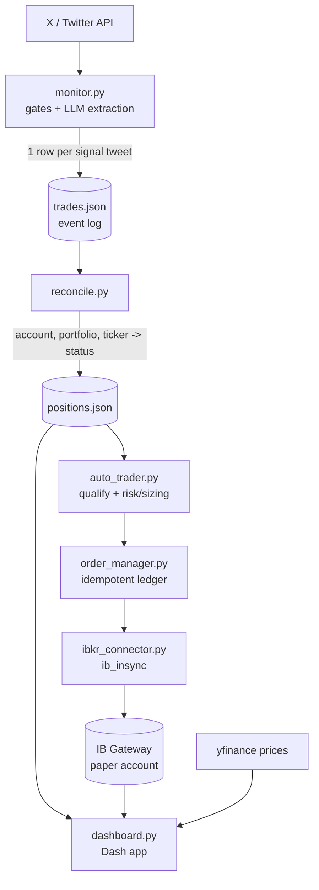

# Pilot Trader

**An AI-driven portfolio-monitoring and paper copy-trading system.** It watches
"AI runs a stock portfolio" bots and finance influencers on X (Twitter), uses
large language models to extract structured trade signals from their posts,
mirrors a chosen subset into an **Interactive Brokers paper account**, and serves
a live dashboard comparing every strategy's return against the S&P 500.

> ⚠️ **Paper trading only — no real money, not financial advice.** See the
> [Disclaimer](#disclaimer).

---

## Why I built it

This started as a personal experiment: *can an LLM reliably turn messy,
free-form social-media posts into structured, executable trade signals — and
how would naively copying those "AI portfolio" bots actually perform?*

It became a sandbox for learning a lot of things end to end:

- **LLM structured extraction** — schema-constrained prompting, vision models for
  reading chart screenshots, cost control via batching and deduplication.
- **Broker automation** — connecting to the Interactive Brokers API, order
  sizing, risk caps, idempotent execution, and reconciliation.
- **Production-style ops** — Dockerized services, cron pipelines, health checks,
  monitoring, and a self-hosted dashboard.

Everything here runs against a **paper account**. The goal was to learn and to
satisfy my own curiosity, not to give or follow investment advice.

---

## Features

- **Multi-account X/Twitter monitoring** — polls a registry of public accounts:
  AI-run portfolio bots (Grok, Claude, DeepSeek, ChatGPT-style), a multi-AI
  contest feed, and human finance influencers.
- **LLM signal extraction** — each tweet is read by Claude under a strict JSON
  schema, yielding portfolio attribution, ticker, direction, sizing, entry,
  stop/target, thesis, and the *actual trade date* (bots often recap old trades).
- **Vision pass** — influencer posts with chart images get a second
  vision-model pass that fills gaps the text didn't cover.
- **Paper copy-trading** — qualifying signals from a configurable subset are
  mirrored to an **IBKR paper account** via the IB Gateway API, with position
  caps, per-ticker daily limits, a circuit breaker, and order reconciliation.
- **Analysis-only research digests** — separate, never-traded feeds summarize
  on-chain/macro analysts and a YouTube analyst, plus a forecast ledger that
  clusters echoed price calls into one row per forecast.
- **Live dashboard** — a dark-themed web app showing normalized performance
  (every portfolio + the paper mirror vs. the S&P 500), holdings, a leaderboard,
  the live paper-account state, and the research digests.
- **Cost-aware by design** — high-water-mark deduplication, the Anthropic Batch
  API, and a cheaper third-party tweet source keep the monthly LLM/API spend in
  the single-digit-dollar range.

---

## Architecture



**Pipeline in words:**

1. `monitor.py` fetches new tweets, applies pre-LLM gates (retweet/reply
   dedup, language and content filters, high-water-mark skipping), then runs
   text (and optional vision) extraction into a strict schema.
2. Each extracted signal is appended to `trades.json` (an append-only event log).
3. `reconcile.py` folds the event log into `positions.json` — a current view
   keyed by `(account, portfolio, ticker)` with open/closed status and sizing.
4. `auto_trader.py` decides which signals qualify for mirroring, applies risk
   and sizing rules, and hands orders to `order_manager.py` (an idempotent
   ledger) → `ibkr_connector.py` → the IB Gateway paper account.
5. `dashboard.py` renders performance, holdings, the live paper account, and the
   research digests.

Separate, **never-traded** pipelines (`youtube_monitor.py`, `twitter_digest.py`)
produce analysis-only research summaries shown in the dashboard.

---

## Tech Stack

| Area | Tools |
|------|-------|
| Language | **Python 3.12** |
| LLM | **Anthropic Claude** — Haiku for text extraction, Sonnet for vision & long-form, via the Messages + Batch APIs |
| Dashboard | **Dash / Plotly** (dark, GitHub-style theme) |
| Brokerage | **Interactive Brokers** via **IB Gateway** + **ib_insync** (paper account) |
| Market data | **yfinance** (prices), RSS (YouTube detection) |
| Data sources | Third-party X/Twitter API, `youtube-transcript-api`, local Whisper fallback |
| Packaging / ops | **Docker** + Docker Compose, cron pipelines, health checks |
| Storage | Plain JSON event logs + state files (no database) |
| Notifications | Telegram (alerts on staleness, gated sells, failures) |

---

## Screenshots

> _Screenshots coming soon._

<!--
Add images here, e.g.:


-->

---

## Project layout (high level)

```
monitor.py          # ingestion + LLM extraction pipeline
reconcile.py        # event log -> current positions
order_manager.py    # idempotent order ledger + risk/sizing
ibkr_connector.py   # Interactive Brokers (IB Gateway) layer
auto_trader.py      # execution glue (signal -> order)
dashboard.py        # Dash web app
twitter_digest.py   # analysis-only X research digests
youtube_monitor.py  # analysis-only YouTube research digests
accounts.py         # monitored-account registry
tests/              # unit tests (ordering, reconciliation, poll gating)
```

---

## Security & contributing

> ⚠️ **This is a public repository — never commit sensitive data.**

This applies to human contributors **and to automated assistants (e.g. Claude
Code sessions)** alike. The following must **never** be committed — they belong
only in a local `.env` (git-ignored) or stay out of the repo entirely:

- **Credentials** — API keys, tokens, bearer tokens, passwords (Anthropic,
  GetXAPI, X/Twitter, Telegram, etc.)
- **Account identifiers** — brokerage / IBKR account IDs, order IDs
- **Network details** — internal/LAN IPs, public IPs, private hostnames or URLs
- **Host details** — SSH keys or key filenames, server usernames, absolute host
  paths
- **Personal data** — emails, phone numbers, addresses

Guidelines:

- **All secrets load from environment variables / `.env`** (which is
  git-ignored). Never hardcode them — reference `os.environ[...]` instead.
- **Runtime data stays out of git** — `positions.json`, `trades.json`, `data/`,
  `tweets_*.json`, logs, and state files are already git-ignored.
- **Review every diff before committing.** If a secret is ever committed, treat
  it as compromised: rotate it immediately and scrub it from git history.

---

## Disclaimer

This is a **personal, educational project**.

- **Paper trading only.** All brokerage activity runs against an Interactive
  Brokers *paper* (simulated) account. No real funds are involved.
- **Not financial advice.** Nothing in this repository is a recommendation to
  buy or sell any security or asset. The signals are automated interpretations
  of third-party social-media content and are frequently wrong.
- **No affiliation.** This project is not affiliated with, endorsed by, or
  sponsored by any of the monitored accounts, Interactive Brokers, Anthropic, or
  any data provider. All monitored accounts are public; their content belongs to
  its respective authors.
- **No warranty.** Provided "as is", for learning and experimentation. Use at
  your own risk.
