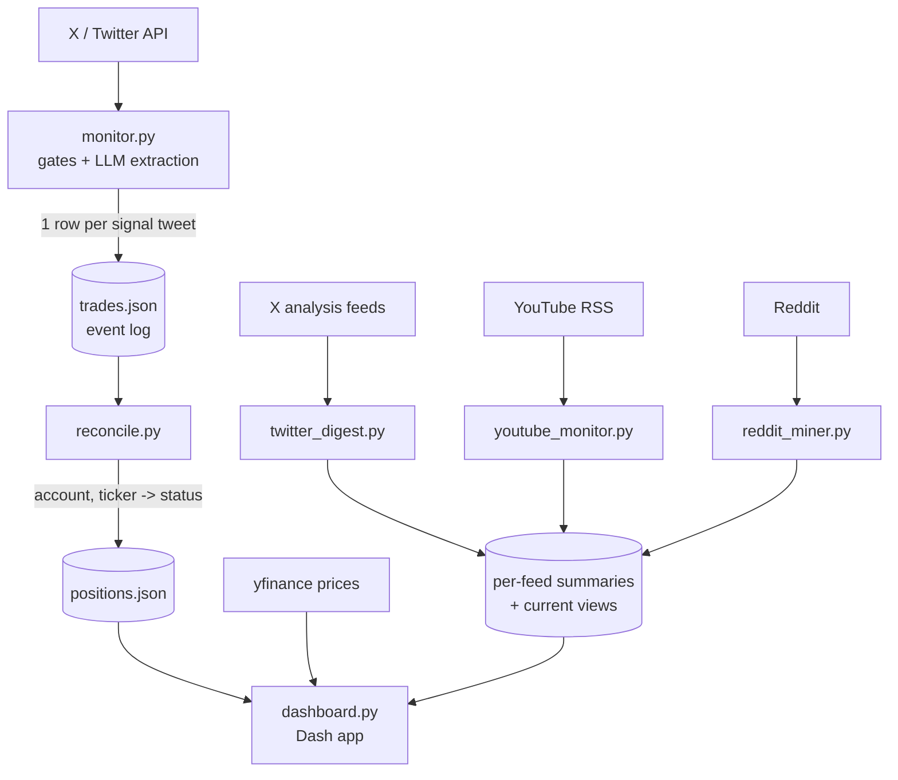

# Pilot Trader

**An LLM-driven trade-call tracker and market-research aggregator.** It watches
finance influencers on X (Twitter), uses large language models to extract
structured trade signals from their posts, tracks how those calls actually
resolve against real prices, and serves a live dashboard alongside
analysis-only research digests of on-chain and macro analysts on X, YouTube and
Reddit.

> ⚠️ **Tracking and research only — no real money, no orders are ever placed,
> not financial advice.** See the [Disclaimer](#disclaimer).

---

## Why I built it

This started as a personal experiment: *can an LLM reliably turn messy,
free-form social-media posts into structured trade signals — and do the people
posting them actually call the market as well as they seem to?*

It became a sandbox for learning a lot of things end to end:

- **LLM structured extraction** — schema-constrained prompting, vision models for
  reading chart screenshots, native video reading, cost control via
  deduplication and pre-LLM gating.
- **Signal evaluation** — resolving each call against real price history
  (target hit / stopped out / expired) instead of taking claimed track records
  at face value.
- **Production-style ops** — Dockerized services, cron pipelines, health checks,
  outage alerting, and a self-hosted dashboard.

Nothing here places orders. The goal was to learn and to satisfy my own
curiosity, not to give or follow investment advice.

---

## Features

- **Multi-account X/Twitter monitoring** — polls a registry of public human
  trade-call accounts and extracts their calls into positions.
- **LLM signal extraction** — each tweet is read by Google Gemini under a strict
  JSON schema, yielding ticker, direction, sizing, entry, stop/target, thesis,
  and the *actual trade date* (posts often recap older trades).
- **Vision pass** — posts with chart images get a second vision-model pass that
  fills gaps the text didn't cover.
- **Analysis-only research digests** — separate, never-traded feeds summarize
  on-chain/macro analysts on X and YouTube, plus a forecast ledger that
  clusters echoed price calls into one row per forecast, and a Reddit strategy
  miner.
- **Consensus view** — every analyst's rolling "current view" (sentiment,
  freshness, stance) side by side on one panel.
- **Live dashboard** — a dark-themed web app showing trade-call performance
  (win rate, target/stop resolution), holdings, and the research digests.
- **Cost-aware by design** — high-water-mark deduplication, pre-LLM gating,
  cheap real-time Gemini calls, and a cheaper third-party tweet source keep the
  monthly LLM/API spend in the low-single-digit-dollar range.

> **Note:** earlier versions of this project also tracked AI-run portfolio bots
> and mirrored their trades to an Interactive Brokers paper account. Both were
> retired in August 2026 (the upstream accounts went dead); the code lives on
> in git history. Everything monitored today is a human trade-call or
> analysis-only account.

---

## Architecture



**Pipeline in words:**

1. `monitor.py` fetches new tweets, applies pre-LLM gates (retweet/reply
   dedup, language and content filters, high-water-mark skipping), then runs
   text (and optional vision) extraction into a strict schema.
2. Each extracted signal is appended to `trades.json` (an append-only event log).
3. `reconcile.py` folds the event log into `positions.json` — a current view
   keyed by `(account, portfolio, ticker)` with open/closed status and sizing.
4. `dashboard.py` renders trade-call performance, holdings, and the research
   digests.

Separate, **never-traded** pipelines (`youtube_monitor.py`, `twitter_digest.py`,
`scripts/reddit_miner.py`) produce analysis-only research summaries shown in the
dashboard. Each keeps its own append-only ledger, which doubles as its
deduplication set, so re-runs are idempotent.

---

## Tech Stack

| Area | Tools |
|------|-------|
| Language | **Python 3.12** |
| LLM | **Google Gemini** — `gemini-2.5-flash-lite` for text extraction and cheap triage, `gemini-3.7-flash` for vision, long-form analysis and native video, via the real-time Gemini API (schema-constrained JSON) |
| Dashboard | **Dash / Plotly** (dark, GitHub-style theme) |
| Market data | **yfinance** (prices), RSS (YouTube detection) |
| Data sources | Third-party X/Twitter and Reddit APIs; YouTube videos read natively by Gemini (no local download or transcript step) |
| Packaging / ops | **Docker** + Docker Compose, cron pipelines, health checks |
| Storage | Plain JSON event logs + state files (no database) |
| Notifications | Telegram (alerts on staleness, gated sells, failures) |

---

## Screenshots

> _Screenshots coming soon._

<!--
Add images here, e.g.:


-->

---

## Project layout (high level)

```
monitor.py             # ingestion + LLM extraction pipeline
reconcile.py           # event log -> current positions
resolver.py            # target/stop resolution for win-rate stats
dashboard.py           # Dash web app
twitter_digest.py      # analysis-only X research digests + forecast ledger
youtube_monitor.py     # analysis-only YouTube research digests
sentiment_history.py   # append-only log of every "current view" synthesis
accounts.py            # monitored-account registry
scripts/               # Reddit strategy miner, model-deprecation check, backup
tests/                 # unit tests (ordering, reconciliation, helpers)
```

---

## Security & contributing

> ⚠️ **This is a public repository — never commit sensitive data.**

This applies to human contributors **and to automated assistants (e.g. Claude
Code sessions)** alike. The following must **never** be committed — they belong
only in a local `.env` (git-ignored) or stay out of the repo entirely:

- **Credentials** — API keys, tokens, bearer tokens, passwords (Google/Gemini,
  GetXAPI, RedditAPI, X/Twitter, Telegram, etc.)
- **Account identifiers** — brokerage account IDs, order IDs
- **Network details** — internal/LAN IPs, public IPs, private hostnames or URLs
- **Host details** — SSH keys or key filenames, server usernames, absolute host
  paths
- **Personal data** — emails, phone numbers, addresses

Guidelines:

- **All secrets load from environment variables / `.env`** (which is
  git-ignored). Never hardcode them — reference `os.environ[...]` instead.
- **Runtime data stays out of git** — `positions.json`, `trades.json`, `data/`,
  `tweets_*.json`, logs, and state files are already git-ignored.
- **Review every diff before committing.** If a secret is ever committed, treat
  it as compromised: rotate it immediately and scrub it from git history.

---

## Disclaimer

This is a **personal, educational project**.

- **No trading.** This project places no orders and connects to no brokerage.
  It only reads public posts and tracks how the calls in them would have
  resolved against historical prices.
- **Not financial advice.** Nothing in this repository is a recommendation to
  buy or sell any security or asset. The signals are automated interpretations
  of third-party social-media content and are frequently wrong.
- **No affiliation.** This project is not affiliated with, endorsed by, or
  sponsored by any of the monitored accounts, Google, or any data provider. All
  monitored accounts are public; their content belongs to its respective
  authors.
- **No warranty.** Provided "as is", for learning and experimentation. Use at
  your own risk.
